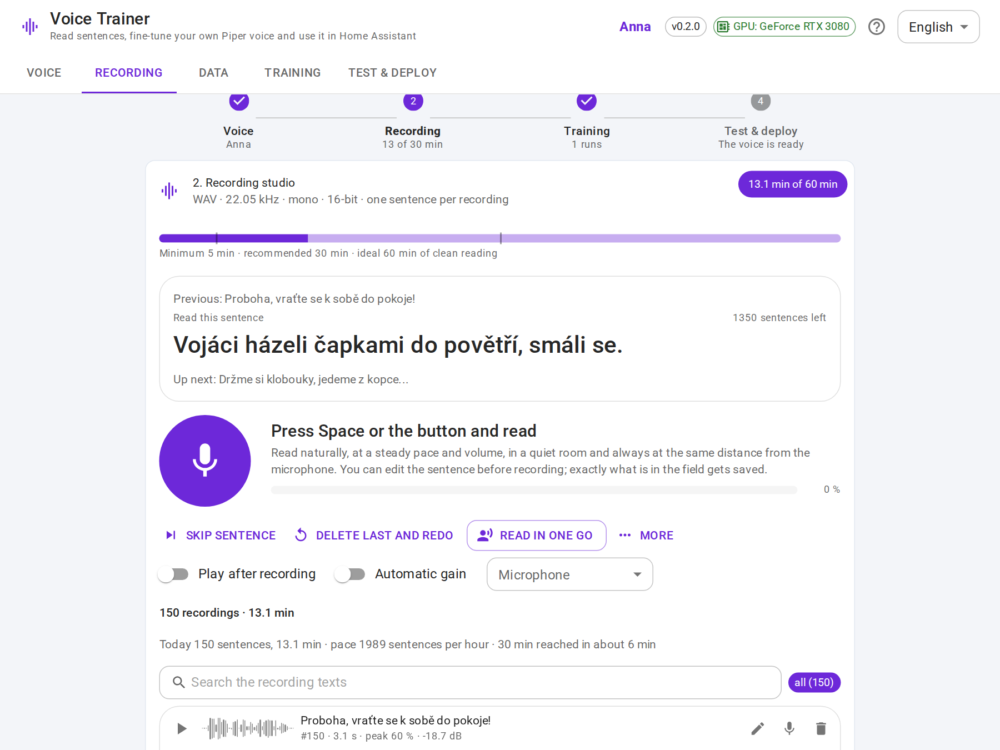
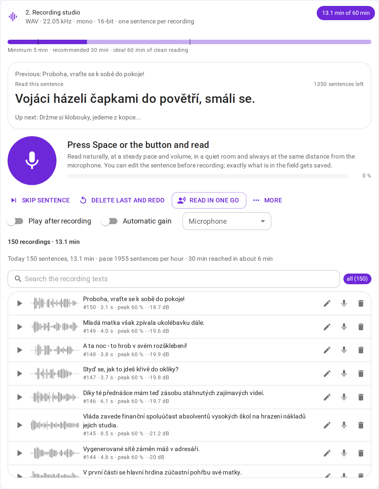
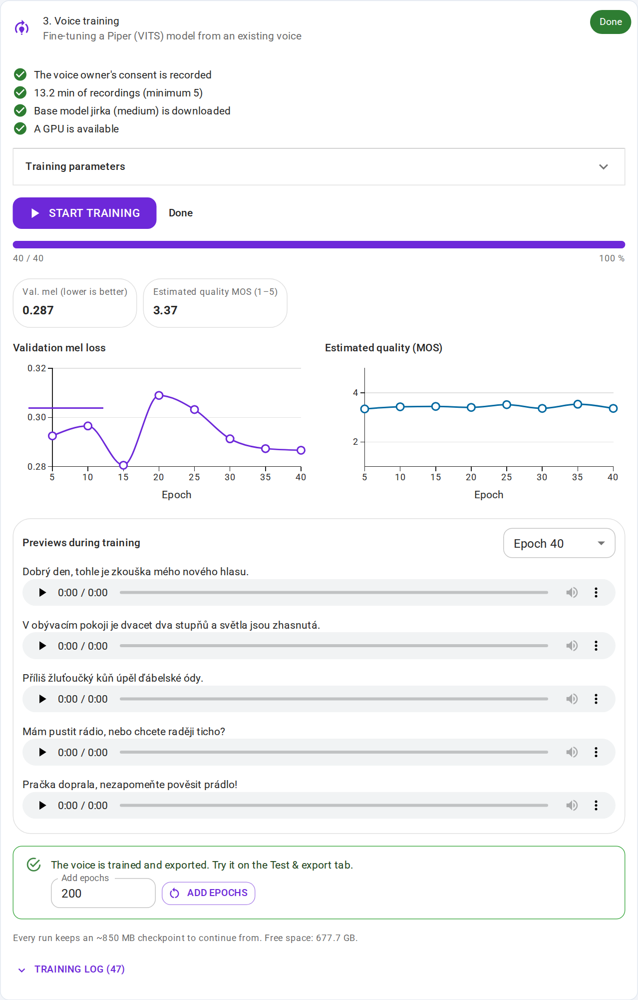
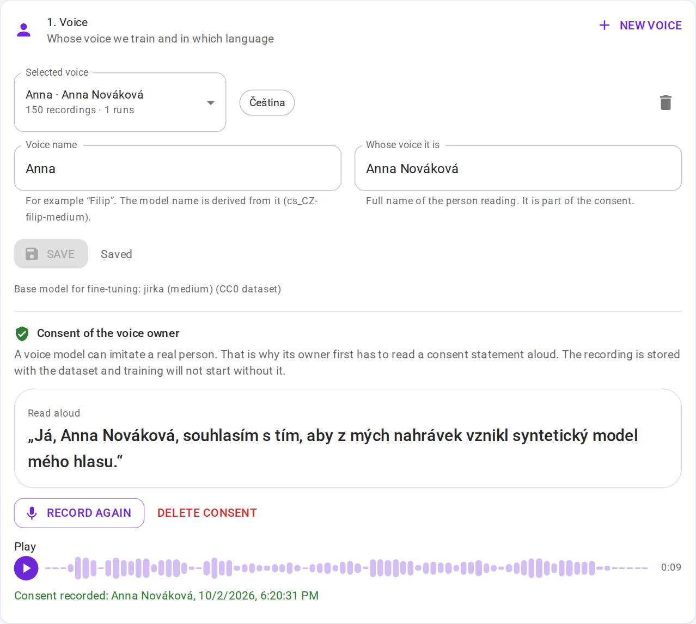
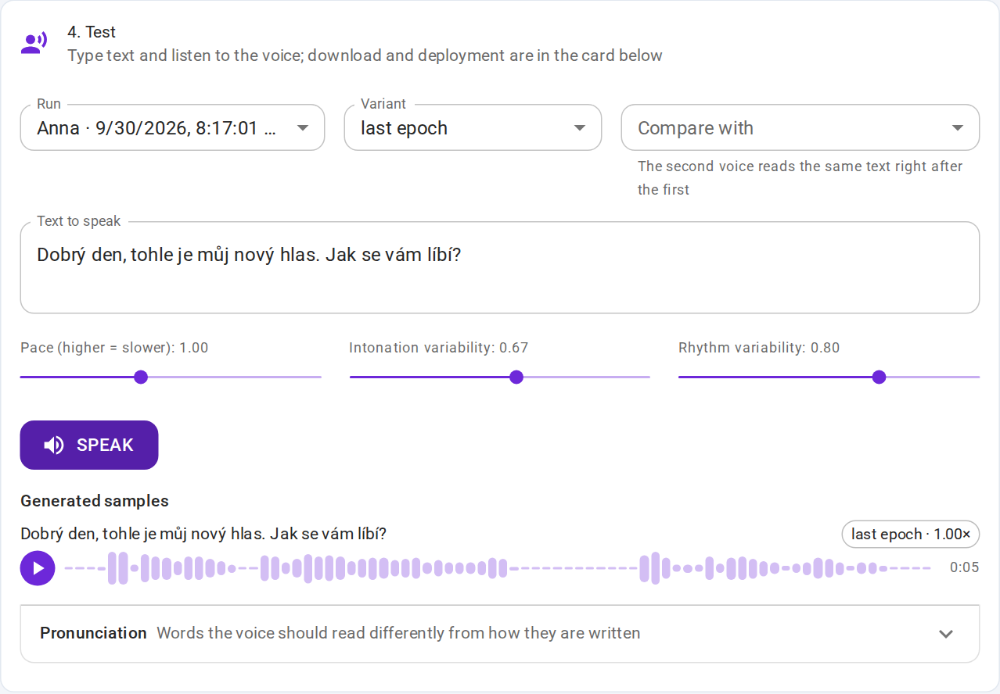
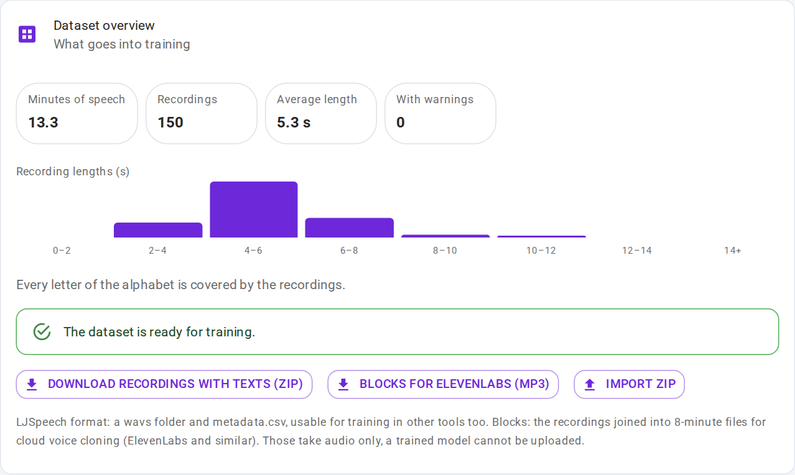
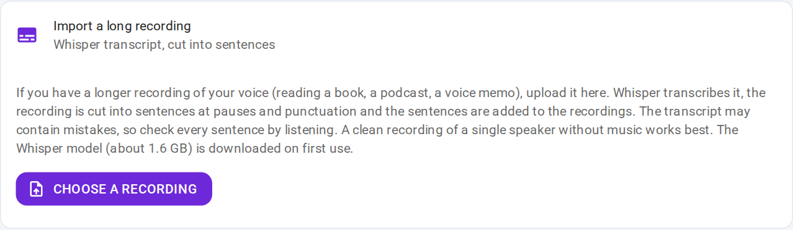

# Voice Trainer

A self-contained web app for recording a voice and fine-tuning a personal text-to-speech model from it:
a [Piper](https://github.com/OHF-Voice/piper1-gpl) voice you can use in Home Assistant, `wyoming-piper`
or on the command line.

Sister project of [wakeword-trainer](https://github.com/FilipChalupa/wakeword-trainer).

<picture>
  <source media="(prefers-color-scheme: dark)" srcset="docs/screenshots/hero-dark.png">
  
</picture>

## Consent first

A voice model can imitate a real person. Every voice here has a named owner, and training refuses to start until
the owner has read a consent statement aloud. The recording is stored next to the dataset, and nothing leaves
your machine: recordings, checkpoints and models live in the local `./data` folder.

Only train voices of people who agreed to it.

## How it works

A step bar at the top shows where the project stands (voice and consent, minutes recorded, training, test) and
the header shows a running training from every tab. A glossary behind the question mark explains the terms.

1. **Voice** – name the voice, enter the owner's name, pick the language (Czech, English) and record the spoken consent.
2. **Recording studio** – sentences are shown one at a time. Press Space, read, and the recording stops by itself
   after you finish. The sentence is the transcript, so no speech recognition is involved. Each take gets quality
   checks (clipping, too quiet, cut off, length not matching the text); you can edit the transcript, re-record or
   add your own sentences or read connected text sentence by sentence: built-in paragraphs, public-domain books
   (Čapek, Hašek, Němcová from Wikisource; Carroll, Doyle, Baum from Project Gutenberg), any web page or pasted
   text. Czech paragraphs with tricky words (loanwords such as software, e-mail, jazz; hard "ti, di, ni" as in
   technika or Martin; consonant clusters; rare sounds; numbers with units, times, dates and abbreviations; names of
   towns, people and rooms) come with built-in rules: espeak reads "software" letter by letter, "25 %" as "procento"
   and "vlk" as an abbreviation, so the training transcript is rewritten the way the sentence is said, and the studio
   shows how a sentence with numbers is meant to be read.
   **Reading in one go** keeps the microphone open and shows the text like a teleprompter: every spoken
   stretch becomes the take of the sentence on screen, Whisper checks each take against its text in the
   background: a take that reads a neighbouring sentence is relabelled, two takes split by a pause are joined,
   the rest of the mismatches land in the review queue; a live speech-to-noise margin warns when the setup
   gets worse. 5 minutes is the minimum, 30 minutes is
   recommended, 60 minutes is ideal; the studio shows today's count, the pace and when the next goal is reached.
   The **Data** tab holds the dataset overview and the imports: the recordings with their texts can be downloaded
   as a ZIP in the LJSpeech layout (`wavs/` + `metadata.csv`) to train with other tools, and such a ZIP can be
   imported back. A long recording (an audiobook chapter, a voice
   memo) can be imported too: Whisper transcribes it and it is cut into sentences at the pauses; the transcripts
   are marked for review. Names and terms the recording contains can be given to Whisper as a hint (the words of
   the pronunciation lexicon are added by themselves). The dataset overview warns when some takes are much louder, quieter or noisier than the
   rest (a different microphone or room makes the trained voice uneven). It also counts the sounds the takes hold little of (dž, dz, ó, au, eu…)
   and names the paragraphs that add them. A take can be marked "record again", and a word espeak most likely
   misreads is flagged until the lexicon covers it. A microphone test measures the room
   noise and your level before a session, a review mode walks through flagged takes and machine transcripts
   with the keyboard, and a phone in the same network can be used as the microphone (QR code, HTTPS with a
   self-signed certificate); the screen stays on while recording. Every take is kept in the browser until the
   server has it: after a lost connection or a restarted server the studio offers to upload what is waiting.
3. **Training** – an existing Piper voice of the same language is fine-tuned on your recordings (the card says how
   many takes were added since the last run). A sound-correction card sets the tone of the copies that go into training
   (high-pass, bass and treble shelves, a suggestion from your takes, the spectrum before and after, one take to
   compare by ear): a close microphone makes a voice boomy and the model learns exactly that. The takes stay as
   they are
   (`piper.train`, VITS, PyTorch Lightning). Progress is streamed live: epochs, losses, validation mel loss and an
   estimated MOS. Every N epochs the test sentences are synthesised so you can *hear* the progress. A run can be
   stopped (the current state is saved first), continued after a restart, or extended with more epochs. The
   expected duration is shown before the start, calibrated by the previous run on the same machine. A run
   stops by itself when the validation loss has not improved for a number of validations (patience). Afterwards
   the trained voice can read every training sentence back; takes it cannot reproduce (misread, wrong
   transcript, noise) are listed for a listen and flagged in the recording list.
4. **Test & export** – type text and listen, compare the last epoch with the best checkpoints, with an older run, with a run of
   another voice of the same language (another microphone) or with the untouched base voice (both read the
   same text back to back), keep a pronunciation list for names and
   abbreviations espeak reads wrong (applied when this app speaks and to the training transcripts; Piper itself has
   no dictionary, so a button writes any text the way it is said, to paste into Home Assistant; words Whisper kept
   hearing differently while checking the takes are suggested), then download
   `<lang>-<name>-medium.onnx` + `.onnx.json` for Piper.

| Recording studio | Training |
| --- | --- |
|  |  |
| **Voice and consent** | **Test & export** |
|  |  |
| **Dataset overview** | **Long recording import** |
|  |  |

Sentences come from the Common Voice sentence collection (CC0), filtered and ordered for phonetic variety. A short
built-in set works offline.

## Requirements

- Docker with Compose.
- An NVIDIA GPU with 8 GB+ of VRAM and `nvidia-container-toolkit` for training (works in WSL2). Recording and testing
  work without a GPU; training on a CPU is impractically slow.
- About 12 GB of disk for the image and the base checkpoint, plus ~1–4 GB per training run and 1.6 GB for the
  Whisper model if you import long recordings.

## Quick start

```bash
cp .env.example .env        # enables the GPU override and sets port 8001
docker compose up --build
```

Open <http://localhost:8001>. The microphone only works on `localhost` or over HTTPS; the app also listens on
<https://localhost:8444> with a self-signed certificate (created in `data/tls` on first start, replace it with your
own `cert.pem`/`key.pem` if you have one). That is the address for a phone in the same network: the studio shows
it as a QR code. In WSL2 the port has to be reachable from the LAN (`networkingMode=mirrored` in `.wslconfig`, or
a `netsh portproxy` rule) and `PUBLIC_HOST` in `.env` should be the Windows IP.

Without a GPU: `docker compose -f docker-compose.yml up --build`.

Optional HTTP Basic auth: set `APP_PASSWORD` in `.env`.

## Using the voice

**Home Assistant (Piper add-on):** copy both files (`.onnx` and `.onnx.json`) into `/share/piper`, restart the
Piper add-on and reload the Wyoming integration. The voice then appears in the text-to-speech settings.

**wyoming-piper:**

```yaml
services:
  piper:
    image: rhasspy/wyoming-piper
    command: --voice cs_CZ-filip-medium
    volumes:
      - ./voices:/data        # put both files here
    ports:
      - "10200:10200"
```

**Command line:** `python3 -m piper -m cs_CZ-filip-medium.onnx -f out.wav -- "Dobrý den."`

## Training notes

- Fine-tuning starts from a published checkpoint (`cs_CZ-jirka-medium`, `en_US-lessac-medium`, ~800 MB, downloaded
  once) with a fresh optimizer; the learning rate decays to 5 % over the run.
- Default: 500 epochs, batch size 16. On an RTX 3080 with 30 minutes of audio an epoch takes a few seconds.
- A checkpoint is ~850 MB. Each run keeps the latest one (to continue from); the best-by-quality checkpoints are
  exported to ONNX and then removed. `KEEP_JOBS` (default 5) limits how many finished runs are kept per voice.
- The checkpoint to continue from is written at every validation and when you stop a run; a crash or a server
  restart loses the epochs since the last validation.
- Long recordings are transcribed with `openai-whisper` (`turbo` model by default, `VT_WHISPER_MODEL` to change it)
  on the GPU when one is available; training and transcription do not run at the same time.
- The estimated MOS uses UTMOS, downloaded on first use. If it cannot be loaded, training still works and only the
  mel loss is shown.

## Project layout

```
backend/app        FastAPI: voices + consent, prompts, recordings (+ dataset export/import), importer (Whisper),
                   base checkpoints, jobs (manager + SSE), check (model vs. recordings), synthesis/export,
                   system info, serve.py (HTTP + HTTPS listeners), static frontend
backend/trainer    fit.py (Piper trainer with progress/preview callbacks), export.py + onnx_export.py (ONNX export),
                   transcribe.py (Whisper transcript + sentence cutting), verify_worker.py (take vs. text check)
backend/tests      pytest suite (no PyTorch needed: pip install -r backend/requirements-dev.txt)
frontend           Vite + React + TypeScript + Material UI, Czech/English, light/dark by system setting
scripts            e2e.sh runs the smoke test (and with --screenshots a demo dataset, a short training and the README
                   screenshots) on a throw-away instance: ports 8101/8544, data in ./data-test, never the one you
                   record in; demo_dataset.py fills a voice with synthetic takes (runs inside the container)
tests/e2e          Playwright smoke test used in CI, screenshots.js re-creates the README screenshots
data/              (runtime) base/, prompts/, voices/<id>/{recordings,jobs,consent.wav}
```

## API

| Method | Path | Description |
| --- | --- | --- |
| GET / POST / DELETE | `/api/voices` · `/api/voices/{id}/select` · `/api/voice` | Voices and settings |
| POST / GET / DELETE | `/api/consent` · `/api/consent/audio` | Spoken consent of the voice owner |
| GET / POST | `/api/prompts` · `/api/prompts/custom` · `/api/prompts/{id}/skip` | Sentences to read |
| GET / POST | `/api/paragraphs` · `/api/paragraphs/{id}/queue` | Built-in connected texts, queued sentence by sentence |
| GET / POST | `/api/library` · `/api/library/{book}` · `/api/library/queue` | Public-domain books, web pages and pasted text as reading queues |
| POST / GET | `/api/recordings/{id}/verify` · `/api/verify` | Whisper check of a take against its sentence (worker stays loaded) |
| GET / POST / PUT / DELETE | `/api/recordings` · `/api/recordings/{id}` · `…/audio` · `…/restore` | Recordings with transcripts |
| GET / POST | `/api/dataset` · `/api/dataset/export` · `/api/dataset/import` | Dataset report, recordings + transcripts as a ZIP (LJSpeech layout) and back |
| POST / GET | `/api/transcribe` · `/api/transcribe/cancel` | Long recording → Whisper transcript → sentence recordings |
| GET / POST | `/api/base` · `/api/base/{lang}/download` | Base checkpoints |
| POST / GET | `/api/train` · `/api/train/resume` · `/api/train/cancel` · `/api/train/status` (SSE) · `/api/train/calibration` | Training |
| GET / POST / DELETE | `/api/jobs` · `/api/jobs/{id}/export` · `/api/jobs/{id}/bundle` · `…/previews/…` | Runs, previews, exported voices |
| POST / GET | `/api/jobs/{id}/check` · `…/check/audio/{rid}` | Recording check with the trained voice |
| GET | `/api/dataset/export/blocks` | Recordings joined into MP3 blocks for cloud voice cloning services |
| POST | `/api/synthesize` | Text to speech with an exported voice (or `job_id: "base"` for the base voice) |
| GET | `/api/system` | GPU, disk space, version |

## License

GPL-3.0-or-later. The trainer imports Piper's training code, which is GPL-3.0. Voices you train are yours;
check the licence of the base checkpoint you fine-tune from (the Czech `jirka` voice is based on a CC0 dataset,
the English `lessac` voice on a research-only dataset).
